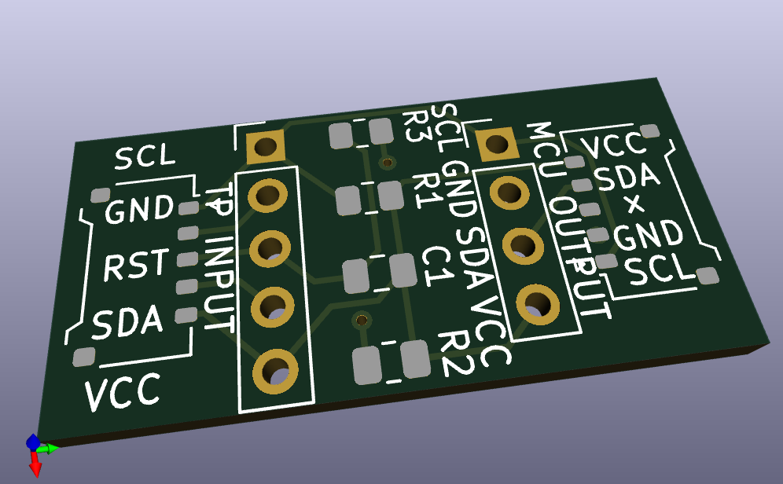
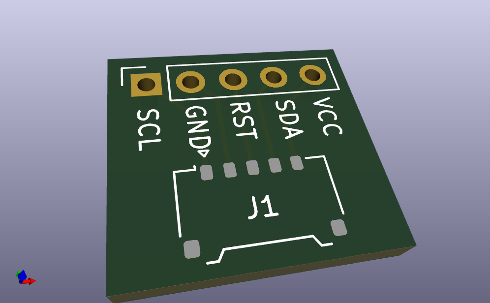

# Ergonomic / Mechanical Keyboard Trackpoint Helper PCBs

A few PCBs that help with connecting and debugging trackpoints to mechanical keyboards using QMK and zmk.

> **Warning**
>
> These circuits have not been tested yet.

## PCBs

### Trackpoing Reset Circuit

Thinkpad trackpoints require a power-on-reset sequence before they can initiate a connection. This circuit allows you to perform this sequence and connect the trackpoint to a device that isn't able to perform it directly such as a QMK keyboard, a USB-to-PS2 adapter, etc...

For more information, check out [Alon Swartz's detailed explanation](https://github.com/alonswartz/trackpoint).

### Trackpoint Man-In-The-Middle (MTM) PCB

A PCB that has a Molex Ezmate Pico connector on one side and a regular socket on the other.

It uses the same connector and pinout as my [ThinkCorney keyboard](https://github.com/infused-kim/kb_think_corney).

Can be used to connect the trackpoint to the ThinkCorney as well as a breadboard, multimeter or logic analyzer for debugging.

## Other useful resources

Here are a few other helpful resources if you are into custom keyboards and trackpoints...

- [ThinkCorney Keyboard](https://github.com/infused-kim/kb_think_corney) - Clone of the corne keyboard, but wireless and with a trackpoint.
- [Alon Swartz Trackpoint Info](https://github.com/alonswartz/trackpoint) - Super useful info about trackpoints, reset circuits, etc.
- [My zmk trackpoint support PR](https://github.com/zmkfirmware/zmk/pull/1751) - Adds trackpoint support to zmk, the popular wireless mechanical keyboard firmware.

## License

**TLDR:**

- Personal use with attribution
- Commercial use not allowed

This work is licensed under a
[Creative Commons Attribution-ShareAlike 4.0 International License][cc-by-sa].

[![CC BY-SA 4.0][cc-by-sa-image]][cc-by-sa]

[cc-by-sa]: http://creativecommons.org/licenses/by-sa/4.0/
[cc-by-sa-image]: https://licensebuttons.net/l/by-sa/4.0/88x31.png
[cc-by-sa-shield]: https://img.shields.io/badge/License-CC%20BY--SA%204.0-lightgrey.svg
